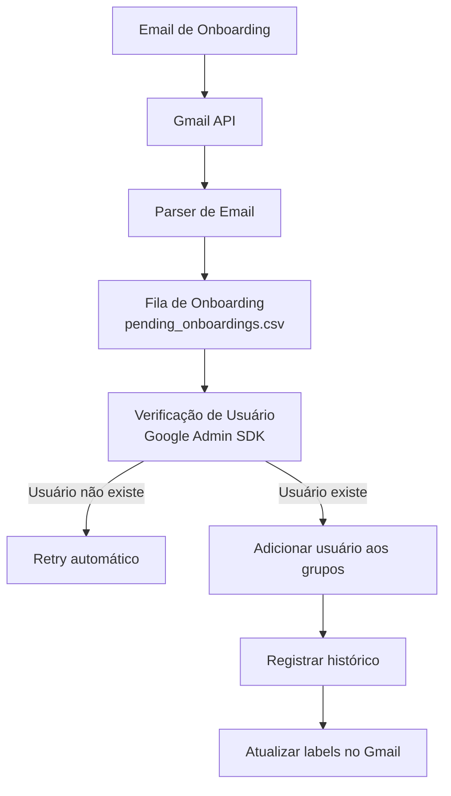

# Workspace Group Automation

Automação em Python para processamento de e-mails de onboarding e gerenciamento automático de grupos no Google Workspace.

O sistema lê e-mails de onboarding enviados para uma caixa específica, extrai os dados do colaborador, aguarda a criação do usuário no Google Workspace e adiciona automaticamente o usuário nos grupos corretos.

---

# Problema

No processo manual de onboarding:

- RH envia um e-mail com dados do novo colaborador
- TI precisa ler o e-mail
- esperar o usuário ser criado no Google Workspace
- adicionar manualmente o usuário em vários grupos

Esse processo:

- consome tempo
- gera erros humanos
- frequentemente grupos são esquecidos

---

# Solução

Esta automação:

1. Lê e-mails de onboarding no Gmail
2. Extrai automaticamente:
   - email do usuário
   - grupos
   - clientes
3. Aplica regras de mapeamento de grupos
4. Coloca o onboarding em uma fila de processamento
5. Aguarda o usuário existir no Google Workspace
6. Adiciona o usuário automaticamente aos grupos corretos
7. Registra histórico de execução

---

# Arquitetura

## Arquitetura do sistema



---

# Tecnologias utilizadas

- Python 3
- Google Workspace Admin SDK
- Gmail API
- Service Account + Domain Wide Delegation
- Pandas
- Logging
- Launchd (macOS scheduler)

---

# Estrutura do Projeto

```
workspace-group-automation
│
├── app
│   ├── config.py
│   ├── gmail_labels.py
│   ├── gmail_reader.py
│   ├── google_client.py
│   ├── group_mapper.py
│   ├── group_service.py
│   ├── history_service.py
│   ├── logger.py
│   ├── main.py
│   └── onboarding_queue.py
│
├── data
│   └── pending_onboardings.csv
│
├── logs
│
├── reports
│   └── onboarding_history.csv
│
├── .env
├── .env.example
├── requirements.txt
└── run_automation.sh
```

---

# Fluxo da automação

1. Email chega com assunto **ONBOARD**
2. O sistema lê o email via Gmail API
3. Extrai automaticamente:
   - `USERNAME SUGERIDO`
   - `GRUPOS`
   - `CLIENTES`
4. Aplica regras de mapeamento de grupos
5. Cria registro na fila
6. Verifica periodicamente se o usuário existe no Google Workspace
7. Quando o usuário aparece:
   - adiciona aos grupos
   - registra histórico
   - marca o email como processado

### Exemplo de entrada

```
GRUPOS: colaboradores, mídia
CLIENTES: Pepsico
```

### Exemplo de saída

```
colaboradores@ampfy.com
midia@ampfy.com
acessoclientes@ampfy.com
acessoclientesbakery@bakery.ag
```

---

# Labels utilizadas no Gmail

| Label | Função |
|------|------|
| onboarding-pendente | onboarding aguardando criação do usuário |
| onboarding-processado | onboarding concluído |
| onboarding-ignorado | email inválido |

---

# Sistema de retry

Se o usuário ainda não existir no Google Workspace:

- o sistema tenta novamente
- respeita um intervalo configurável
- possui limite máximo de tentativas

Configuração atual:

```python
MAX_ATTEMPTS = 500
RETRY_INTERVAL_HOURS = 2
```

---

# Histórico de execução

Todos os eventos são registrados em:

```
reports/onboarding_history.csv
```

Exemplo de estrutura:

```
timestamp,message_id,email,group,status,message
```

---

# Logs

Os logs são gravados em:

```
logs/automation.log
```

e também em:

```
logs/cron.log
```

---

# Segurança

O projeto utiliza:

- Service Account
- Domain Wide Delegation
- Escopos mínimos de acesso

Escopos utilizados:

```
admin.directory.user.readonly
admin.directory.group
admin.directory.group.member
gmail.modify
```

O arquivo de credenciais **não é incluído no repositório**.

---

# Configuração

Crie um arquivo `.env` baseado no exemplo:

```
cp .env.example .env
```

Depois edite o arquivo `.env` com os dados do seu ambiente:

```
DELEGATED_ADMIN_EMAIL=admin@empresa.com
GOOGLE_APPLICATION_CREDENTIALS=credentials.json
```

---

# Como executar

Instalar dependências:

```
python3 -m pip install -r requirements.txt
```

Executar manualmente:

Windows

```
python -m app.main
```

macOS / Linux

```
python3 -m app.main
```

---

# Execução automática

A automação é executada via scheduler do sistema com `launchd` no macOS.

Script utilizado:

```
run_automation.sh
```

---

# Possíveis melhorias futuras

- Banco de dados em vez de CSV
- Dashboard de monitoramento
- Deploy em Cloud Run
- Interface de administração

---

# Autor

Bruno Cardoso  
Automação de processos e integrações com Google Workspace.